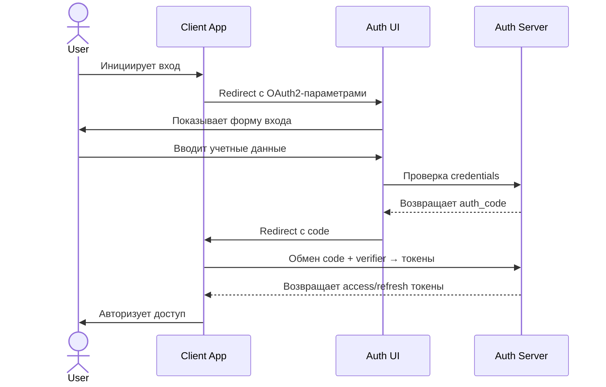

# Кастомизированный OAuth2 Flow с отдельным приложением авторизации

## Архитектурные компоненты
1. **Клиентское приложение (Client App)**  
   - Веб/Mobile приложение, инициирующее процесс авторизации
   - Пример: SPA на React, iOS/Android приложение

2. **Приложение авторизации (Auth UI)**  
   - Отдельный фронтенд для аутентификации пользователей
   - Реализует: формы входа, согласие на доступ, ошибки
   - Пример: SSR приложение на Next.js

3. **Сервер авторизации (Auth Server)**  
   - Бэкенд с OAuth2-логикой (NestJS)
   - Функционал:  
     - Валидация учетных данных  
     - Генерация кодов/токенов  
     - Управление клиентами OAuth2  

---

## Детализированный процесс авторизации

### 1. Инициализация потока (Client App → Auth UI)
**Шаги:**
1. Пользователь кликает "Войти" в Client App
2. Client App выполняет:
   ```javascript
   const codeVerifier = generateCryptoSecureRandomString(43);
   const codeChallenge = sha256(codeVerifier).toBase64Url();
   
	// Создаём базовый URL
	const authUrl = new URL('https://auth-ui.com/login');
	
	// Инициализируем параметры запроса
	const params = new URLSearchParams({
	  client_id: 'CLIENT_ID',
	  redirect_uri: CLIENT_CALLBACK_URL, // автоматическое кодирование
	  code_challenge: codeChallenge,
	  response_type: 'code',
	  state: 'UNIQUE_CSRF_TOKEN'
	});
	
	// Добавляем параметры к URL
	authUrl.search = params.toString();
	
	// Открываем окно с безопасными параметрами
	window.open(
	  authUrl.href,
	  '_self',
	  'noopener,noreferrer'
	);
   ```

| Параметр        | Обязательность   | Описание                              |
|-----------------|------------------|---------------------------------------|
| `client_id`     | Да               | Идентификатор клиента                 |
| `redirect_uri`  | Да               | URI для возврата после авторизации    |
| `code_challenge`| Да (PKCE)        | Хеш code_verifier (S256)              |
| `response_type` | Да               | Фиксированное значение `"code"`       |
| `state`         | Рекомендуется    | Токен защиты от CSRF                  

---

### 2. Аутентификация пользователя (Auth UI ↔ Auth Server)
**Процесс:**
1. **Auth UI** отображает форму входа  
   - Запрашивает только необходимые scope

2. **Отправка данных** на Auth Server:
   ```typescript
   // Auth UI отправляет POST /auth/login
   const response = await fetch('https://auth-server.com/login', {
     method: 'POST',
     headers: {'Content-Type': 'application/json'},
     body: JSON.stringify({
       email: 'user@example.com',
       password: '•••••••',
       client_id: 'CLIENT_ID',
       code_challenge: 'XYZ...'
     })
   });
   ```

3. **Auth Server** выполняет:
   - Валидацию учетных данных
   - Проверку соответствия client_id и redirect_uri
   - Генерацию authorization_code (связывает с code_challenge)
   - Возвращает Auth UI:
     ```json
     {
       "code": "A1B2C3D4",
       "expires_in": 300,
       "state": "ORIGINAL_CSRF_TOKEN"
     }
     ```

---

### 3. Возврат кода авторизации (Auth UI → Client App)
**Механизм передачи:**
1. Auth UI перенаправляет на `redirect_uri` клиента:
   ```http
   HTTP 302 Found
   Location: https://client-app.com/callback?
     code=A1B2C3D4
     &state=ORIGINAL_CSRF_TOKEN
   ```

2. **Client App**:
   - Валидирует совпадение state-параметра
   - Сохраняет code_verifier (из шага 1) в secure storage
   - Инициирует обмен кода на токен

---

### 4. Обмен кода на токены (Client App → Auth Server)
**Запрос:**
```http
POST /oauth/token HTTP/1.1
Host: auth-server.com
Content-Type: application/x-www-form-urlencoded

grant_type=authorization_code
&code=A1B2C3D4
&redirect_uri=https://client-app.com/callback
&client_id=CLIENT_ID
&code_verifier=ORIGINAL_SECRET_STRING
```

**Проверки Auth Server:**
1. Валидация code_verifier → code_challenge
2. Проверка привязки кода к client_id
3. Подтверждение срока действия кода

**Успешный ответ:**
```json
{
  "access_token": "eyJhbGci...",
  "refresh_token": "def502...",
  "expires_in": 3600,
  "token_type": "Bearer",
  "scope": "profile email"
}
```

---

## Схема взаимодействия


---

## Особенности реализации
### Для Auth UI:
- **Динамическая конфигурация**  
  Получение данных клиента (логотипы, разрешенные scopes) через API Auth Server

- **Перенаправление ошибок**  
  Пример: `https://client-app.com/error?code=auth_failed&state=XYZ`

- **Многофакторная аутентификация**  
  Интеграция с SMS/Email/TOTP через Auth Server

### Для Auth Server:
- **Хранение сессий**  
  Redis для временного сохранения code ↔ challenge

- **Аудит действий**  
  Логирование всех попыток авторизации

- **Ротация секретов**  
  Автоматическая смена client_secret для confidential clients

---

## Защитные механизмы
1. **PKCE Enforcement**  
   Обязательная проверка для всех public clients

2. **Rate Limiting**  
   Ограничение попыток входа (/login endpoint)

3. **CSP Headers**  
   Защита Auth UI от XSS:
   ```http
   Content-Security-Policy: 
     default-src 'self';
     script-src 'self' 'nonce-ABC123'
   ```

4. **HSTS Preloading**  
   Обязательное HTTPS для всех компонентов

---

## Терминологическое уточнение
- **End-User** - Пользователь, предоставляющий доступ
- **Resource Owner** - Владелец данных (часто совпадает с End-User)
- **Authorization Grant** - Право доступа (в данном случае - code)
- **Token Endpoint** - URL для обмена кода на токены (/oauth/token)
- **Back-Channel** - Прямое взаимодействие между Client App и Auth Server (без UA)