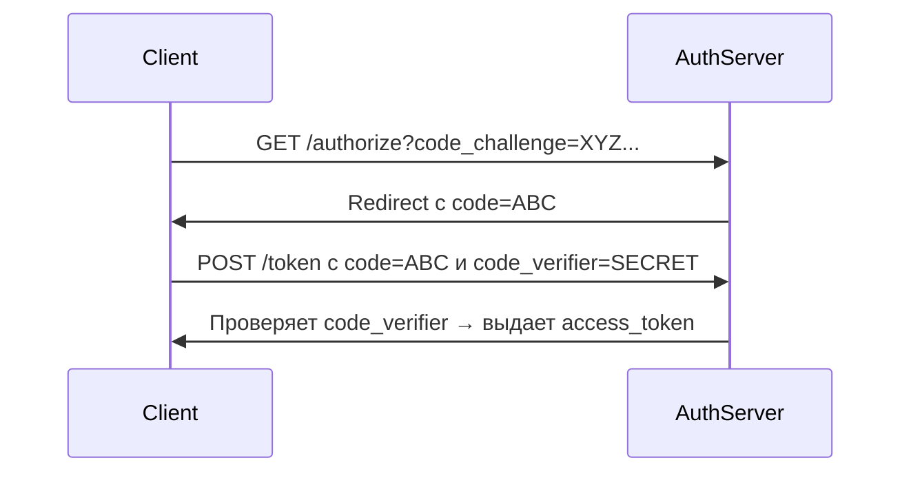

**PKCE (Proof Key for Code Exchange)** — это механизм безопасности в OAuth 2.0, предназначенный для защиты **публичных клиентов** (например, мобильных приложений, SPA) от перехвата кода авторизации. Он стал обязательным для публичных клиентов в OAuth 2.1.

---

### **🔍 Для чего нужен PKCE?**
Раньше в OAuth 2.0 публичные клиенты (где нельзя безопасно хранить `client_secret`) использовали **Implicit Flow**, который был уязвим к атакам. PKCE решает две ключевые проблемы:
1. **Перехват кода авторизации**: Злоумышленник может украсть `authorization_code` из URL (например, через историю браузера).
2. **Подмена клиента**: Атакующий подменяет `redirect_uri`, чтобы получить токен.

---

### **🛠 Как работает PKCE?**
1. **Клиент генерирует `code_verifier`**  
   Это случайная строка (минимум 43 символа, [A-Za-z0-9-._~]).  
   Пример:  
   ```javascript
   const codeVerifier = crypto.randomBytes(32).toString('base64url');
   ```

2. **Создание `code_challenge`**  
   Клиент хеширует `code_verifier` (обычно через SHA-256) и кодирует в `base64url`.  
   Пример:  
   ```javascript
   const codeChallenge = crypto
     .createHash('sha256')
     .update(codeVerifier)
     .digest('base64url');
   ```

3. **Запрос авторизации**  
   Клиент отправляет `code_challenge` и метод хеширования (`S256`) на сервер авторизации:  
   ```
   GET /authorize?response_type=code
     &client_id=CLIENT_ID
     &redirect_uri=REDIRECT_URI
     &code_challenge=XYZ...123
     &code_challenge_method=S256
   ```

4. **Обмен кода на токен**  
   При получении `authorization_code`, клиент отправляет исходный `code_verifier`:  
   ```http
   POST /token
   Content-Type: application/x-www-form-urlencoded

   grant_type=authorization_code
   &code=AUTH_CODE
   &redirect_uri=REDIRECT_URI
   &client_id=CLIENT_ID
   &code_verifier=ORIGINAL_VERIFIER
   ```

5. **Проверка на сервере**  
   Сервер вычисляет `code_challenge` из `code_verifier` и сравнивает с сохраненным значением. Если совпадает — выдает токен.

---

### **🛡 Какие атаки предотвращает?**
- **Authorization Code Interception**: Даже если злоумышленник перехватит `authorization_code`, он не сможет обменять его на токен без `code_verifier`.
- **Client Impersonation**: Без `code_verifier` поддельный клиент не получит токен.

---

### **📜 Пример полного потока**


---
